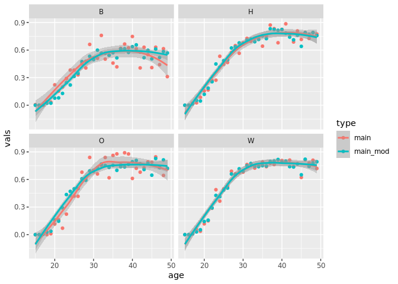
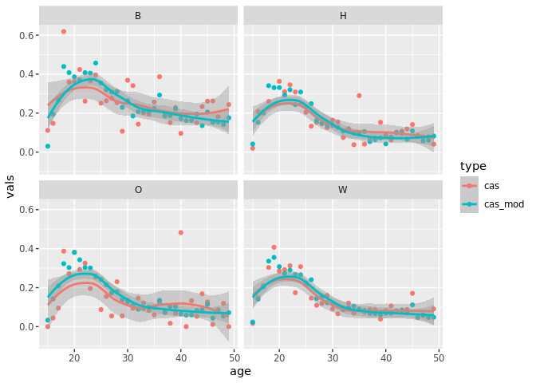

# Network Dev & Diagnostics
Emily D. Pollock
2025-02-25

    Loading required package: deSolve

    Loading required package: networkDynamic

    Loading required package: network


    'network' 1.19.0 (2024-12-08), part of the Statnet Project
    * 'news(package="network")' for changes since last version
    * 'citation("network")' for citation information
    * 'https://statnet.org' for help, support, and other information


    'networkDynamic' 0.11.4 (2023-12-10?), part of the Statnet Project
    * 'news(package="networkDynamic")' for changes since last version
    * 'citation("networkDynamic")' for citation information
    * 'https://statnet.org' for help, support, and other information

    Loading required package: tergm

    Loading required package: ergm


    'ergm' 4.7.5 (2024-11-06), part of the Statnet Project
    * 'news(package="ergm")' for changes since last version
    * 'citation("ergm")' for citation information
    * 'https://statnet.org' for help, support, and other information

    'ergm' 4 is a major update that introduces some backwards-incompatible
    changes. Please type 'news(package="ergm")' for a list of major
    changes.

    Registered S3 method overwritten by 'tergm':
      method                   from
      simulate_formula.network ergm


    'tergm' 4.2.1 (2024-10-08), part of the Statnet Project
    * 'news(package="tergm")' for changes since last version
    * 'citation("tergm")' for citation information
    * 'https://statnet.org' for help, support, and other information


    Attaching package: 'tergm'

    The following object is masked from 'package:ergm':

        snctrl

    Loading required package: statnet.common


    Attaching package: 'statnet.common'

    The following object is masked from 'package:ergm':

        snctrl

    The following objects are masked from 'package:base':

        attr, order

The doc loads network fits and runs performance diagnostics.

Main Network (Marriages, Cohabitations)

``` r
main_dynamic <- netdx(main, dynamic = TRUE, nsims = 10, nsteps = 1000, ncores = 10)
```


    Network Diagnostics
    -----------------------
    - Simulating 10 networks
    - Calculating formation statistics

``` r
main_dynamic
```

    EpiModel Network Diagnostics
    =======================
    Diagnostic Method: Dynamic
    Simulations: 10
    Time Steps per Sim: 1000

    Formation Diagnostics
    -----------------------
                                            Target  Sim Mean Pct Diff  Sim SE
    edges                                27120.629 25723.510   -5.152  36.603
    nodematch.race.B                      1870.425  1723.466   -7.857   4.178
    nodematch.race.H                      4138.240  4104.891   -0.806  49.001
    nodematch.race.W                     14445.608 14131.496   -2.174  13.922
    nodefactor.race.B                     4969.983  4493.098   -9.595  17.711
    nodefactor.race.H                    10476.340  9848.738   -5.991  16.488
    nodefactor.race.W                    32781.070 31407.165   -4.191  31.974
    nodefactor.floor(age).17                30.364    36.920   21.592   1.334
    nodefactor.floor(age).18               123.027   109.991  -10.596   1.362
    nodefactor.floor(age).19               119.991   184.601   53.846   3.396
    nodefactor.floor(age).20               384.507   322.031  -16.249   3.392
    nodefactor.floor(age).21               465.154   486.919    4.679   2.749
    nodefactor.floor(age).22               714.642   650.788   -8.935   6.639
    nodefactor.floor(age).23              1119.726  1132.859    1.173   2.957
    nodefactor.floor(age).24              1131.975  1127.396   -0.405   3.027
    nodefactor.floor(age).25              1335.966  1475.783   10.466   5.519
    nodefactor.floor(age).26              1374.288  1537.578   11.882   5.954
    nodefactor.floor(age).27              1819.523  1731.166   -4.856   4.184
    nodefactor.floor(age).28              1765.211  1816.476    2.904   2.533
    nodefactor.floor(age).29              1929.680  1819.992   -5.684   5.656
    nodefactor.floor(age).30              1864.091  1764.291   -5.354   3.783
    nodefactor.floor(age).31              2020.874  2055.495    1.713   2.288
    nodefactor.floor(age).32              2066.556  1829.133  -11.489   7.238
    nodefactor.floor(age).33              2129.664  2010.021   -5.618   3.812
    nodefactor.floor(age).34              2038.060  1825.486  -10.430   6.785
    nodefactor.floor(age).35              2033.320  1835.189   -9.744   6.274
    nodefactor.floor(age).36              2118.037  2019.878   -4.634   2.794
    nodefactor.floor(age).37              2209.305  2168.581   -1.843   1.948
    nodefactor.floor(age).38              2202.877  1959.641  -11.042   6.803
    nodefactor.floor(age).39              2227.489  2111.471   -5.208   3.631
    nodefactor.floor(age).40              2278.880  2078.930   -8.774   4.144
    nodefactor.floor(age).41              2272.088  2075.475   -8.653   4.904
    nodefactor.floor(age).42              2136.298  2059.937   -3.574   2.299
    nodefactor.floor(age).43              1952.275  1835.416   -5.986   2.310
    nodefactor.floor(age).44              2172.422  2009.251   -7.511   3.082
    nodefactor.floor(age).45              1868.347  1834.210   -1.827   2.956
    nodefactor.floor(age).46              2220.309  2037.792   -8.220   4.518
    nodefactor.floor(age).47              2080.776  1935.638   -6.975   3.571
    nodefactor.floor(age).48              2128.612  2010.543   -5.547   3.315
    absdiff.sqrt(age_adj)                 7277.463  7952.078    9.270 231.943
    offset(nodefactor.deg_casual>0.TRUE)        NA     0.000       NA     NaN
    offset(nodefactor.floor(age).15)            NA     0.000       NA     NaN
    offset(nodefactor.floor(age).16)            NA     0.000       NA     NaN
                                         Z Score SD(Sim Means) SD(Statistic)
    edges                                -38.169        25.894       302.619
    nodematch.race.B                     -35.174        12.481        33.814
    nodematch.race.H                      -0.681        16.724       147.517
    nodematch.race.W                     -22.563        16.901       104.790
    nodefactor.race.B                    -26.926        18.681       117.736
    nodefactor.race.H                    -38.065        24.201       140.149
    nodefactor.race.W                    -42.969        34.203       285.558
    nodefactor.floor(age).17               4.914         4.251         6.988
    nodefactor.floor(age).18              -9.574         6.741         9.631
    nodefactor.floor(age).19              19.025        11.300        19.250
    nodefactor.floor(age).20             -18.422        10.459        18.864
    nodefactor.floor(age).21               7.918        12.472        18.782
    nodefactor.floor(age).22              -9.619        13.365        34.330
    nodefactor.floor(age).23               4.442         9.506        21.425
    nodefactor.floor(age).24              -1.513        15.347        23.170
    nodefactor.floor(age).25              25.333         9.642        35.427
    nodefactor.floor(age).26              27.426        14.949        38.391
    nodefactor.floor(age).27             -21.116         9.670        29.360
    nodefactor.floor(age).28              20.236         5.743        21.237
    nodefactor.floor(age).29             -19.395         9.282        41.548
    nodefactor.floor(age).30             -26.379        12.803        30.997
    nodefactor.floor(age).31              15.133         9.845        21.180
    nodefactor.floor(age).32             -32.800        11.103        53.017
    nodefactor.floor(age).33             -31.389         9.759        32.992
    nodefactor.floor(age).34             -31.330         6.943        49.285
    nodefactor.floor(age).35             -31.578        12.882        46.131
    nodefactor.floor(age).36             -35.134         6.187        25.061
    nodefactor.floor(age).37             -20.902         8.727        20.508
    nodefactor.floor(age).38             -35.753         7.104        52.162
    nodefactor.floor(age).39             -31.953         6.463        32.939
    nodefactor.floor(age).40             -48.249         9.848        38.409
    nodefactor.floor(age).41             -40.093         8.738        42.114
    nodefactor.floor(age).42             -33.222        10.339        22.011
    nodefactor.floor(age).43             -50.581        10.375        23.462
    nodefactor.floor(age).44             -52.936         6.865        30.239
    nodefactor.floor(age).45             -11.548        12.120        23.921
    nodefactor.floor(age).46             -40.397         8.649        39.308
    nodefactor.floor(age).47             -40.646         8.903        31.516
    nodefactor.floor(age).48             -35.612        11.292        30.557
    absdiff.sqrt(age_adj)                  2.909        29.843       857.645
    offset(nodefactor.deg_casual>0.TRUE)      NA         0.000         0.000
    offset(nodefactor.floor(age).15)          NA         0.000         0.000
    offset(nodefactor.floor(age).16)          NA         0.000         0.000

    Duration Diagnostics
    -----------------------
          Target Sim Mean Pct Diff Sim SE Z Score SD(Sim Means) SD(Statistic)
    edges    460  467.131     1.55  2.459     2.9         1.949         7.459

    Dissolution Diagnostics
    -----------------------
          Target Sim Mean Pct Diff Sim SE Z Score SD(Sim Means) SD(Statistic)
    edges  0.002    0.002    1.541      0  11.351             0             0

Casual Network

``` r
cas_dynamic <- netdx(cas, dynamic = TRUE, nsims = 10, nsteps = 1000, ncores = 10)
```


    Network Diagnostics
    -----------------------
    - Simulating 10 networks
    - Calculating formation statistics

``` r
cas_dynamic
```

    EpiModel Network Diagnostics
    =======================
    Diagnostic Method: Dynamic
    Simulations: 10
    Time Steps per Sim: 1000

    Formation Diagnostics
    -----------------------
                                    Target Sim Mean Pct Diff Sim SE  Z Score
    edges                         7809.068 5148.792  -34.066 29.802  -89.264
    nodematch.race.B               900.030  861.701   -4.259  2.171  -17.654
    nodematch.race.H              1208.057  837.722  -30.655  4.293  -86.265
    nodematch.race.W              3247.284 2183.773  -32.751 12.363  -86.020
    nodefactor.race.B             3066.147 2263.617  -26.174  7.978 -100.592
    nodefactor.race.H             2916.195 2045.063  -29.872  9.689  -89.906
    nodefactor.race.W             8086.233 5153.570  -36.267 34.045  -86.140
    nodefactor.floor(age).15        75.224   79.095    5.146  0.708    5.465
    nodefactor.floor(age).16       412.311  365.335  -11.393  1.413  -33.258
    nodefactor.floor(age).17       591.428  490.104  -17.132  1.799  -56.329
    nodefactor.floor(age).18      1020.961  723.275  -29.157  4.118  -72.296
    nodefactor.floor(age).19      1013.822  696.388  -31.311  3.830  -82.889
    nodefactor.floor(age).20       896.783  616.501  -31.254  3.394  -82.575
    nodefactor.floor(age).21       933.798  642.972  -31.144  3.436  -84.635
    nodefactor.floor(age).22       899.623  601.316  -33.159  3.827  -77.944
    absdiff.sqrt(age_adj)         2565.137 2247.164  -12.396  3.499  -90.873
    concurrent                     598.590  393.272  -34.300  3.954  -51.924
    offset(nodefactor.deg_main.1)       NA    0.000       NA    NaN       NA
                                  SD(Sim Means) SD(Statistic)
    edges                                13.539       357.453
    nodematch.race.B                      4.263        27.532
    nodematch.race.H                      6.923        51.732
    nodematch.race.W                     11.198       149.604
    nodefactor.race.B                    12.662       105.095
    nodefactor.race.H                    12.306       118.372
    nodefactor.race.W                    20.254       403.525
    nodefactor.floor(age).15              2.749         8.488
    nodefactor.floor(age).16              3.494        18.023
    nodefactor.floor(age).17              5.635        23.661
    nodefactor.floor(age).18              7.335        49.112
    nodefactor.floor(age).19              7.341        46.605
    nodefactor.floor(age).20              5.995        42.840
    nodefactor.floor(age).21              8.770        41.757
    nodefactor.floor(age).22              5.397        45.680
    absdiff.sqrt(age_adj)                11.053        50.573
    concurrent                            3.908        40.781
    offset(nodefactor.deg_main.1)         0.000         0.000

    Duration Diagnostics
    -----------------------
          Target Sim Mean Pct Diff Sim SE Z Score SD(Sim Means) SD(Statistic)
    edges     48   49.102    2.296  0.478   2.304         0.127         2.593

    Dissolution Diagnostics
    -----------------------
          Target Sim Mean Pct Diff Sim SE Z Score SD(Sim Means) SD(Statistic)
    edges  0.021    0.021   -0.137      0  -1.484             0         0.002

Inst Network

``` r
inst_static <- netdx(inst, dynamic = FALSE, nsims = 1000)
```


    Network Diagnostics
    -----------------------
    - Simulating 1000 networks

    Best valid proposal 'BDStratTNT' cannot take into account hint(s) 'triadic'.


    - Calculating formation statistics

``` r
inst_static
```

    EpiModel Network Diagnostics
    =======================
    Diagnostic Method: Static
    Simulations: 1000

    Formation Diagnostics
    -----------------------
                            Target Sim Mean Pct Diff Sim SE Z Score SD(Sim Means)
    edges                  105.448  105.366   -0.078  0.407  -0.202            NA
    nodefactor.race.B       40.698   39.851   -2.081  0.306  -2.763            NA
    nodefactor.race.H       34.966   35.028    0.176  0.266   0.232            NA
    nodefactor.race.W      121.011  121.871    0.711  0.544   1.581            NA
    nodefactor.age_group.1  38.510   38.203   -0.796  0.396  -0.773            NA
    nodefactor.age_group.2  63.160   63.124   -0.057  0.474  -0.075            NA
    nodefactor.age_group.3  40.503   40.263   -0.593  0.332  -0.723            NA
    absdiff.sqrt(age_adj)   34.638   34.454   -0.530  0.159  -1.154            NA
                           SD(Statistic)
    edges                         10.053
    nodefactor.race.B              6.735
    nodefactor.race.H              6.528
    nodefactor.race.W             13.624
    nodefactor.age_group.1         7.980
    nodefactor.age_group.2         9.239
    nodefactor.age_group.3         7.697
    absdiff.sqrt(age_adj)          4.646

Plot: Empirical vs Modeled

``` r
## empirical dist

x <- yaml::read_yaml(here::here("params", "nw_params.yaml"))
nw <- inst$newnetwork

emp <- data.frame(
  main = x$main$nodefactor$age_race,
  cas = x$casual$nodefactor$age_race,
  age = rep(15:49, each = 4),
  race = rep(c("B", "H", "O", "W"), 7),
  names = paste0(rep(15:49, each = 4), c("B", "H", "O", "W"))
)

# modeled dist
dat <- data.frame(
  age = floor(nw %v% "age"),
  age_group = nw %v% "age_group",
  race = nw %v% "race",
  d = nw %v% "deg_main",
  c = nw %v% "deg_casual"
)

comp <- dat |>
  dplyr::group_by(age, race) |>
  dplyr::summarize(
    main_mod = mean(d),
    cas_mod = mean(c)
  ) |>
  dplyr::left_join(emp, by = c("age", "race")) |>
  tidyr::pivot_longer(
    cols = c("main", "main_mod", "cas", "cas_mod"),
    names_to = c("type"), values_to = "vals"
  )
```

    `summarise()` has grouped output by 'age'. You can override using the `.groups`
    argument.

``` r
comp |>
  dplyr::filter(type %in% c("main", "main_mod")) |>
  ggplot2::ggplot(ggplot2::aes(x = age, y = vals, col = type)) +
  ggplot2::geom_point() +
  ggplot2::geom_smooth(span = 0.75) +
  ggplot2::facet_wrap(~race)
```

    `geom_smooth()` using method = 'loess' and formula = 'y ~ x'



``` r
comp |>
  dplyr::filter(type %in% c("cas", "cas_mod")) |>
  ggplot2::ggplot(ggplot2::aes(x = age, y = vals, col = type)) +
  ggplot2::geom_point() +
  ggplot2::geom_smooth(span = 0.75) +
  ggplot2::facet_wrap(~race)
```

    `geom_smooth()` using method = 'loess' and formula = 'y ~ x'


